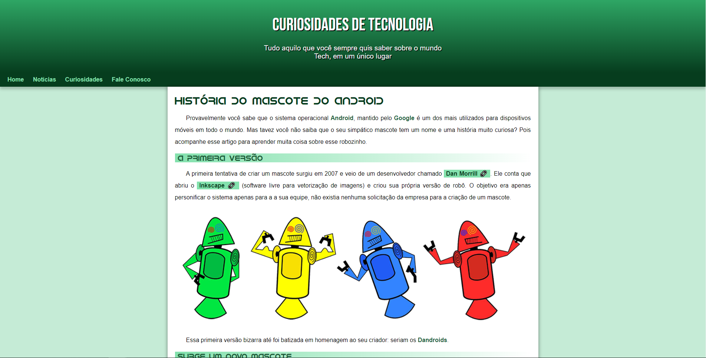

## Projeto Curso em Víddo - História do Mascote do Android

  

## Um pouco do Projeto:

➡ Um site explicanddo as curiosidadeds sobre a história do mascote do android, desde o primeiro até o atual

## Conteúdos

- [Overview](#overview)
  - [Como rodar o projeto](#como-rodar-o-projeto)
  - [Screenshot](#screenshot)
  - [Links](#links)
- [Processo](#processo)
  - [Tecnologia utilizadas](#tecnologias-utilizadas)
  - [O que eu aprendi](#oque-eu-aprendi)
- [Autor](#autor)

## Overview

### Como rodar o projeto

 1. Primeiramente é necessário ter o node js instalado(caso não tenha, apenas baixe a pasta zip do projeto) 
 2. Clone o projeto com `git clone https://github.com/glsvitoria/Projeto-Android.git`
 3. Após clonar o projeto, basta apenas abrir o html principal do site e utilizar as suas funcionalidades

### Screenshot

## Processo

### Tecnologias utilizadas:

### O que eu aprendi
 - Tornar um vídeo (iframe) responsivo
 - Utilização de emotes por código na https://emojipedia.org/

## Autor
- Linkedin - [Guilherme Vitória](https://www.linkedin.com/in/glsvitoria/)
- GitHub - [glsvitoria](https://github.com/glsvitoria)
- Instagram - [glsvitoria](https://www.instagram.com/glsvitoria/)
